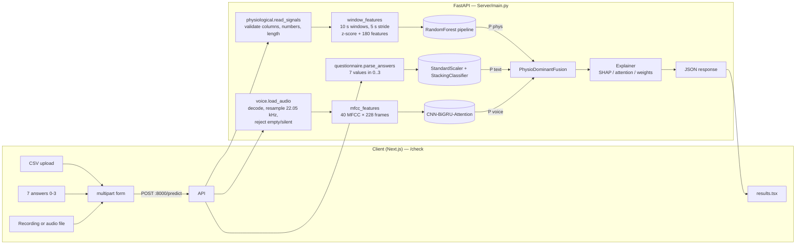

# SafeSpace code walkthrough

SafeSpace estimates a person's stress level (Low / Medium / High) from three inputs: wearable
signals, seven questionnaire answers and a short voice recording. Each input has its own model;
a fixed late-fusion rule combines their outputs. This document explains every stage, what each
model is, and what is and is not verified.

SafeSpace is a research prototype. Its output is not a medical diagnosis.

**How facts in this document were established.** Model details come from inspecting the saved
artifacts in `Server/models/` (estimator types, hyper-parameters, stored training statistics,
Keras configs). Pipeline behaviour comes from the code and from the test suite in
`Server/tests/`. The training notebooks, training data and evaluation results are **not** in
this repository; anything that depends on them is marked *unverified*. No accuracy figure in
this document comes from an evaluation run.

---

## Contents

1. [Directory structure](#1-directory-structure)
2. [Architecture](#2-architecture)
3. [The API contract](#3-the-api-contract)
4. [Model 1 — physiological signals](#4-model-1--physiological-signals)
5. [Model 2 — questionnaire (DASS-21 stress items)](#5-model-2--questionnaire-dass-21-stress-items)
6. [Model 3 — voice](#6-model-3--voice)
7. [Late fusion](#7-late-fusion)
8. [Explanations](#8-explanations)
9. [Frontend flow](#9-frontend-flow)
10. [Testing](#10-testing)
11. [Missing and unverified components](#11-missing-and-unverified-components)
12. [Glossary of ML concepts](#12-glossary-of-ml-concepts)

---

## 1. Directory structure

```text
safespace-f/
├── CODE_WALKTHROUGH.md            this document
├── README.md                      setup and run instructions
├── sample_physiological_data.csv  synthetic 2,000-row, 100 Hz test CSV (ECG, EDA, EMG, Temp)
├── Content/                       poster and presentation assets
├── Client/                        Next.js 15 frontend
│   ├── app/
│   │   ├── page.tsx               landing page
│   │   ├── check/page.tsx         the assessment: CSV upload, 7 answers, voice recording, submit
│   │   ├── check/results.tsx      renders the API response
│   │   ├── check/analysis.ts      client for /predict/stream (upload + stage progress)
│   │   ├── check/AnalysisProgress.tsx  progress bar shown while the models run
│   │   ├── stress-buster/page.tsx two relaxation mini-games
│   │   └── components/            landing sections, navbar, footer, games
│   └── package.json               pnpm 10.10.0; next, react, gsap, lucide-react, tailwindcss
└── Server/                        FastAPI backend
    ├── main.py                    HTTP layer: /predict and /health
    ├── latefusion_final.py        import shim so models/fusion_model.pkl still unpickles
    ├── safespace/                 the ML pipeline
    │   ├── config.py              constants: class order, sample rates, window sizes, artifact paths
    │   ├── physiological.py       CSV validation, windowing, 180-feature extraction
    │   ├── questionnaire.py       DASS-21 item list and answer validation
    │   ├── voice.py               audio decoding, resampling, MFCCs, Attention layer
    │   ├── fusion.py              PhysioDominantFusion (late fusion rule)
    │   ├── explanations.py        SHAP, attention and fusion-weight explanations
    │   └── artifacts.py           loads all models once at startup
    ├── models/                    saved artifacts (see table below)
    ├── tests/                     pytest suite (72 tests) + synthetic speech fixture
    ├── requirements.txt           pinned runtime dependencies
    └── requirements-dev.txt       + pytest, httpx
```

### Model artifacts

| File | Used by API | Contents (verified by loading it) |
|---|---|---|
| `models/regularized_global_model.pkl` | yes | scikit-learn `Pipeline`: `StandardScaler` → `SelectKBest(f_classif, k=50)` → `RandomForestClassifier` |
| `models/stacking_classifier_model.pkl` | yes | scikit-learn `StackingClassifier` (RF, LogisticRegression, GaussianNB → LogisticRegression) |
| `models/scaler.pkl` | yes | `StandardScaler` for the 7 questionnaire answers |
| `models/model_finetuned.h5` | yes | Keras 2.13.1 CNN → 2× BiGRU → Attention → Dense, input (228, 40, 1) |
| `models/Voice.h5` | no | Earlier variant of the voice model: same layers, input reshaped to 400 time steps, saved with Keras 3.8.0 (cannot be loaded by the pinned TensorFlow 2.13) |
| `models/fusion_model.pkl` | no | A pickled `PhysioDominantFusion` with `class_weights=(0.7, 0.0, 0.3)`; predicts identically to the rule the API builds |
| `models/lateFusion.pkl` | no | Pickle of a `__main__.FusionModel` class that does not exist in this repository and was saved with NumPy 2.x; it cannot be loaded |
| `scaler.pkl` (in `Server/`) | no | Numerically identical duplicate of `models/scaler.pkl` |

---

## 2. Architecture



All three inputs are required. If any input fails validation the API returns HTTP 422 with a
readable message; it never replaces a modality with a default probability vector.

---

## 3. The API contract

`POST /predict` (multipart/form-data). Interactive docs at `http://localhost:8000/docs`.

| Field | Type | Rules |
|---|---|---|
| `physiological_file` | file | `.csv`, ≤ 50 MB, UTF-8, columns `ECG`, `EDA`, `EMG`, `Temp` (case-insensitive, extra columns ignored), numeric and non-empty, **sampled at 100 Hz**, ≥ 1,000 rows |
| `dass21_responses` | text | exactly 7 numbers in 0–3, as `1,2,0,3,1,2,0` or `[1,2,0,3,1,2,0]` |
| `voice_audio` | file | `.wav .mp3 .m4a .flac .ogg .webm`, ≤ 25 MB; not empty, decodable, and speech must start within the first 5.3 s (the part the model analyses). WebM/M4A/MP3 decoding needs `ffmpeg` on the server |

Responses:

* **200** — `predictions` (`physio_probs`, `dass21_probs`, `voice_probs`, `fusion_probs`,
  `fusion_pred`, `prediction_label`, `confidence`), `explanations` (`physiological`,
  `questionnaire`, `voice`, `fusion`) and `metadata` (window count, feature count, answers,
  decoded voice duration (up to 60 s), original and analysed sample rates, seconds of audio analysed).
* **422** — `{"success": false, "error": "Validation Error", "message": "...", "error_type": "validation"}`.
  A missing form field returns FastAPI's standard 422 body.
* **413** — an upload over its size limit, same shape.
* **500** — unexpected server error, same shape with `error_type: "server"`.

`confidence` is the largest fused probability. It is not a measured accuracy.

`POST /predict/stream` takes the same form and returns the same result, streamed as
newline-delimited JSON so the frontend can show real progress:

```text
{"type": "queued"}                                           only if another analysis is running
{"type": "stage", "stage": "physiological", "index": 1, "total": 5}
{"type": "stage", "stage": "questionnaire", "index": 2, "total": 5}
{"type": "stage", "stage": "voice", "index": 3, "total": 5}
{"type": "stage", "stage": "fusion", "index": 4, "total": 5}
{"type": "stage", "stage": "explanations", "index": 5, "total": 5}
{"type": "result", "status": 200, "body": { ...same as /predict... }}
```

Upload problems (wrong type, too large) are a normal 413/422 response before streaming starts;
pipeline errors arrive as a `result` event with `status` 422 or 500 and the usual error body.
Both endpoints run the same `_run_pipeline` function in `main.py`.

Both endpoints are synchronous, so the pipeline runs in a worker thread and the server keeps
answering other requests (e.g. `/health`) during model work. Model calls are serialised by a
lock because the shap `KernelExplainer` keeps per-call state on its instance; concurrent
predictions therefore queue rather than run in parallel. TensorFlow compiles its prediction
functions on first use, so `load_models` runs the voice model once on a blank input at startup
(startup ≈ 7 s); after that a request took 0.2–0.45 s on the CPU-only test machine.

`GET /health` returns the loaded model types, the voice input shape and the physiological
feature count.

---

## 4. Model 1 — physiological signals

### Data flow

| Stage | Code | What happens |
|---|---|---|
| Ingestion | `main.predict` | Accept only `.csv` filenames; read bytes |
| Validation | `physiological.read_signals` | Decode UTF-8; parse CSV; require the four sensor columns; convert to numbers and reject any empty/non-numeric/infinite cell; require ≥ 1,000 rows |
| Windowing | `physiological.window_features` | 1,000-row windows (10 s at 100 Hz) starting every 500 rows (5 s); rows after the last full window are not used. The 2,000-row sample gives 3 windows |
| Normalisation | `physiological.zscore` | Each sensor inside each window: `(x − mean) / std`; a constant window becomes zeros |
| Features | `extract_window_features` | 180 numbers per window (table below); NaN/±inf become 0 |
| Inference | `physiological.predict` | `model.predict_proba` per window, then the mean over windows → `P(Low, Medium, High)` |

### Features (180 per window)

| Group | Per sensor | Details |
|---|---|---|
| Time domain | 13 | mean, std, variance, skew, kurtosis, min, max, peak-to-peak, median, 25th and 75th percentile, mean absolute first difference, RMS |
| Frequency domain | 11 | Welch PSD (`nperseg = 250`): power and relative power in 0–0.04, 0.04–0.15, 0.15–0.4 and 0.4–0.5 Hz; mean and std of the frequency axis; peak frequency |
| Wavelet | 20 | `db4`, 4 levels → coefficient arrays a4, d4, d3, d2, d1; mean, std, variance and max\|c\| of each |
| ECG heart-rate variability | 4 (ECG only) | R-peaks via `find_peaks(height = std, distance = 33 samples)`; mean RR, SDNN-style RR std, RMSSD (ms), heart rate (bpm) |

ECG: 13 + 11 + 20 + 4 = 48. EDA, EMG, Temp: 44 each. Total 180.

### The model (verified from the artifact)

```text
StandardScaler (fitted on 11,609 windows)
  → SelectKBest(score_func=f_classif, k=50)        ANOVA F-test keeps 50 of 180 features
  → RandomForestClassifier(n_estimators=50, max_depth=8, min_samples_split=10,
                           min_samples_leaf=5, max_features="sqrt", max_samples=0.8,
                           class_weight="balanced", random_state=42)
classes_ = [0, 1, 2] → Low, Medium, High
```

The 50 selected features are 27 EMG, 13 EDA, 9 Temp and 1 ECG (`ECG_mean_abs_diff`). None of
the four heart-rate-variability features are used by the model.

### Training methodology

What the artifact shows: 11,609 training windows passed through the scaler; the forest uses
class-balanced weights; feature selection is univariate (ANOVA F). What it does not show:
the train/test split, the subjects used, or any evaluation result.

The feature code mirrors a removed script (`predict_wesad.py`) whose configuration names WESAD
chest signals at 700 Hz downsampled by 7 to 100 Hz, and the label mapping
`{0: 0, 3: 0, 2: 1, 1: 2}` with class names Low, Medium, High. Under the public WESAD label
convention (1 = baseline, 2 = stress, 3 = amusement, 0 = transient) that mapping would make
**High = baseline** and **Medium = stress**. This is *unverified*: the training code is not
available, so it is unknown whether this mapping was used for the saved model.

### Known issues (verified)

1. **Normalisation mismatch between training and the API.** The scaler stores the training
   distribution of every feature. With per-window z-scoring, every window's mean is 0 and std
   is 1, yet in training the average `EDA_std` was 0.025 (±0.032) and `Temp_std` 0.063
   (±0.029), and `Temp_mean` averaged −1.39. The training windows were therefore normalised
   differently (the pattern suggests per-recording normalisation, but the exact procedure is
   unknown). The API sends values far outside the training range for several of the 50
   selected features (`EDA_mean`, `EDA_rms`, `EMG_std`, `EMG_rms`, `Temp_mean`, `Temp_rms`).
   Physiological probabilities from the API should be treated as unvalidated until the
   training preprocessing is recovered and matched.
2. **No resampling.** The API assumes 100 Hz. A 700 Hz file is accepted but each "10 s"
   window would only cover 1.4 s.
3. **Unusable frequency band.** With 250-sample Welch segments the resolution is 0.4 Hz, so
   the 0.04–0.15 Hz band never contains a bin. The scaler confirms 16 features (low-band power
   and relative power, frequency mean and std, for every sensor) were constant in training.
   They are kept because the model expects them.

---

## 5. Model 2 — questionnaire (DASS-21 stress items)

### Data flow

| Stage | Code | What happens |
|---|---|---|
| Ingestion | `main.predict` | `dass21_responses` form text |
| Validation | `questionnaire.parse_answers` | JSON array or comma list; exactly 7 finite numbers (not booleans) in 0–3 |
| Preprocessing | `questionnaire.predict` | `models/scaler.pkl` standardises each answer with the training mean and std |
| Inference | `questionnaire.predict` | `StackingClassifier.predict_proba` → `P(Low, Medium, High)` |

The seven statements are the DASS-21 stress subscale items (original numbers 1, 6, 8, 11, 12,
14, 18), asked in that order by the frontend. Before this refactor the API labelled them with
unrelated DASS-21 items (e.g. "dry mouth", "trembling hands"); the labels now match the
questions the user actually answers.

### The model (verified from the artifact)

```text
StandardScaler (fitted on 64 samples)
StackingClassifier(cv=5, stack_method="predict_proba", passthrough=False)
  rf  RandomForestClassifier(n_estimators=30, max_depth=3, min_samples_leaf=10,
                             min_samples_split=20, class_weight="balanced", oob_score=True)
  lr  LogisticRegression(C=0.01, multinomial, class_weight="balanced")
  nb  GaussianNB()
  final_estimator LogisticRegression(C=1.0, class_weight="balanced") on the 9 stacked probabilities
```

Stacking: each base model is trained with 5-fold cross-validation to produce out-of-fold
probabilities; the final logistic regression learns how to weigh those 3 × 3 probabilities.

### Training methodology

What the artifact shows: **64 training samples** — 28 Low, 15 Medium, 21 High (GaussianNB's
`class_count_`). The per-class mean of every scaled answer rises from Low to High, which is
consistent with Low < Medium < High stress. The random forest's stored out-of-bag score is
**0.625**; this is an internal training statistic of one base model on 64 samples, not a
held-out evaluation. The source of the 64 samples and how their labels were assigned are
*unverified*.

A sanity test confirms all-0 answers predict Low and all-3 answers predict High.

---

## 6. Model 3 — voice

The voice model is compulsory: the API and the frontend both require a recording, and any
decoding or feature failure returns HTTP 422.

### Data flow

| Stage | Code | What happens |
|---|---|---|
| Ingestion | `main.predict` | Read uploaded bytes; the browser records `recorded_audio.webm` (Opus) |
| Decoding | `voice.load_audio` | Allowed extension; non-empty; decodes (librosa → soundfile, or ffmpeg via audioread) at most the first 60 s; finite samples |
| Resampling | `voice.load_audio` | Every upload is resampled to **22,050 Hz** |
| Speech check | `voice.load_audio` | Rejects a recording that is silent (RMS < 1e-4), whose first 5.3 s are silent, or whose first 5.3 s are more than 20 dB quieter than the rest (speech starts too late). Without this, the model scored the silent lead-in: 6 s of silence before speech came back as Low 0.69 |
| Features | `voice.mfcc_features` | Pad clips shorter than 1 s; 40 MFCCs per frame (librosa defaults: 2,048-sample FFT, 512-sample hop); pad or truncate to **228 frames ≈ 5.3 s**; shape (1, 228, 40, 1) |
| Inference | `voice.predict` | Keras `predict` → softmax `P(Low, Medium, High)` |

Only the first ~5.3 s of a recording reach the model; the response reports
`voice_seconds_analysed`.

### The model (verified from `model_finetuned.h5`)

```text
Input (228, 40, 1)                         228 MFCC frames × 40 coefficients
Conv2D(64, 3×3, same) → BatchNorm → ReLU → Dropout(0.3)
Reshape → (228, 2560)                      one 2,560-value vector per frame
Bidirectional GRU(64, return_sequences)    → (228, 128)
Bidirectional GRU(64, return_sequences)    → (228, 128)
Dropout(0.3)
Attention                                  e = tanh(xW + b); a = softmax over time; Σ a·x → (128)
Dense(128, ReLU) → Dropout(0.3) → Dense(3, softmax)
1,101,031 parameters
```

Training configuration stored in the file: categorical cross-entropy loss, accuracy metric,
Adam optimiser with learning rate 1e-4. The name and the earlier `Voice.h5` (learning rate
9e-6, 400-step input) suggest the deployed model is a fine-tuned version; the training data,
labels and results are *unverified*. Previous documentation states it was trained on RAVDESS
and IEMOCAP; those are acted-emotion corpora, and how emotion labels were mapped to
Low/Medium/High stress is not recorded.

### Why the API resamples to 22,050 Hz

Measured with the same synthetic speech in this repository's environment:

| Clip | Native-rate decoding (old behaviour) | Resampled to 22,050 Hz |
|---|---|---|
| calm speech, 22.05 kHz WAV | Medium 0.94 | Medium 0.94 |
| calm speech, 48 kHz WAV | High 0.53 | Medium 0.95 |
| calm speech, 48 kHz WebM (browser format) | High 0.51 | Medium 0.96 |
| fast speech, 22.05 kHz WAV | High 0.77 | High 0.77 |
| fast speech, 48 kHz WAV | Medium 0.98 | High 0.72 |

Decoding at the native rate changed each MFCC frame's duration, so the prediction depended on
the microphone. 22,050 Hz is librosa's default load rate, and 228 frames × 512 / 22,050 =
5.3 s matches the length of the longest RAVDESS clips. The training rate is still *unverified*
and should be confirmed against the training notebook.

### Known issues (verified)

* The model assigns almost no probability to Low on every input tried (speech, tones, noise).
* Non-speech input (white noise, an all-zero matrix) produces High ≈ 0.999. Silence is now
  rejected, but noise is not detected.
* Before this refactor, a missing `setuptools` made MFCC extraction crash on clean installs,
  and the crash was silently replaced by an all-zero feature matrix, so every request got the
  same voice output (High 0.9987). `setuptools` is now pinned and failures return 422.

---

## 7. Late fusion

`safespace/fusion.py` — `PhysioDominantFusion`. Late fusion means each modality is modelled
separately and only their output probabilities are combined.

### Formula

For modality *m* ∈ {physiological, questionnaire, voice} with base weight *w*ₘ and probability
vector **p**ₘ = (p_Low, p_Medium, p_High):

```text
base weights            w_phys = 0.60, w_text = 0.25, w_voice = 0.15      (sum to 1)
confidence              cₘ = max(pₘ)
effective weight        eₘ = wₘ × cₘ
raw score per class     r_c = Σₘ eₘ × pₘ[c]
normalisation           f_c = r_c / (r_Low + r_Medium + r_High)
final class             argmax_c f_c        → "Low" | "Medium" | "High"
confidence (response)   max_c f_c
```

Every modality must be present and each vector must be non-negative and sum to 1; otherwise
`FusionInputError` (HTTP 422). The rule has no trained parameters (`fit` does nothing). The
`class_weights` argument is stored for compatibility with `fusion_model.pkl` but is not used;
in the old code it was only applied when a true label was passed, which the API never did.

### Worked example (actual API output)

Inputs: `sample_physiological_data.csv`, answers `1,2,0,3,1,2,0`,
`tests/fixtures/speech_sample.wav`.

| Modality | P(Low, Medium, High) | wₘ | cₘ | eₘ = wₘcₘ | share of Σe |
|---|---|---|---|---|---|
| physiological | 0.4884, 0.2431, 0.2685 | 0.60 | 0.4884 | 0.2930 | 53.7 % |
| questionnaire | 0.4602, 0.4147, 0.1251 | 0.25 | 0.4602 | 0.1150 | 21.1 % |
| voice | 0.0002, 0.9182, 0.0816 | 0.15 | 0.9182 | 0.1377 | 25.2 % |

```text
r_Low    = 0.2930×0.4884 + 0.1150×0.4602 + 0.1377×0.0002 = 0.1960
r_Medium = 0.2930×0.2431 + 0.1150×0.4147 + 0.1377×0.9182 = 0.2453
r_High   = 0.2930×0.2685 + 0.1150×0.1251 + 0.1377×0.0816 = 0.1043
f = (0.3593, 0.4497, 0.1911)  →  Medium, confidence 0.4497
```

Physiological and questionnaire both lean Low, but the voice model's decisive Medium tips the
result: because effective weights scale with confidence, a very confident low-weight model
can outweigh an uncertain high-weight one.

### Verification

`tests/test_fusion.py` checks the formula against a hand calculation, the weights, unanimous
inputs, that voice can change the result, that each modality is required, malformed input
rejection, and that `models/fusion_model.pkl` gives identical output. `tests/test_api.py`
recomputes the fusion from the probabilities in a real `/predict` response.

---

## 8. Explanations

| Modality | Method | Meaning of a value |
|---|---|---|
| physiological | `shap.TreeExplainer` on the random forest (exact TreeSHAP, tree-path-dependent, no background sample), applied to the 50 selected and scaled features; averaged over windows | change in P(*target_class*) attributable to the feature; positive = toward the class the physiological model predicted |
| questionnaire | `shap.KernelExplainer` with the training-mean answers (`scaler.mean_`) as the single reference; 7 features, so all 128 coalitions are evaluated | contribution of each answer to P(*target_class*) relative to an average training respondent; values sum exactly to P(x) − P(reference) (tested) |
| voice | class probabilities, plus the Attention layer's weights over the 228 frames | share of attention on real (unpadded) audio and the times it peaked |
| fusion | the effective weights eₘ from section 7 | `contribution_score` = eₘ / Σe |

Explanations describe the models' behaviour, not causes of stress. If an explanation fails, it
is returned with `available: false` and an `error`; the prediction still returns.

Before this refactor: the physiological explainer always failed on the pipeline and fell back
to feature variance while still labelled "SHAP"; the questionnaire explainer averaged SHAP
values across classes, which is ≈ 0 by construction, and used random background rows; both
used random "dummy" background data.

---

## 9. Frontend flow

`Client/app/check/page.tsx` collects the three inputs. Analysis is enabled only when a CSV is
uploaded, all seven statements are answered (0 "Never" is a valid answer; nothing is
pre-selected), and a recording or audio file exists. The recorder uses `MediaRecorder` with the
first format the browser supports — WebM/Opus in Chrome, Edge and Firefox, MP4/AAC (sent as
`.m4a`) in Safari — and lets the user play back or discard the clip; leaving the page releases the
microphone. The page posts `physiological_file`, `dass21_responses` (comma list) and
`voice_audio` to `${NEXT_PUBLIC_API_URL}/predict/stream` (default `http://localhost:8000`) with
`XMLHttpRequest`, which reports upload progress and lets the page read stage events as they
stream in. `AnalysisProgress.tsx` turns them into a progress bar, shown under the Analyze button
and, with the list of steps, in the results area. Each step owns a slice of the bar (upload
0–15 %, body signals –30 %, answers –38 %, voice –80 %, combining –84 %, explanations –97 %);
upload progress is exact, and within a server stage the bar eases toward the end of that slice
but only moves past it when the server reports the next stage. The page also adds a deliberate 5-second
wait (`EXTRA_WAIT_MS` in `page.tsx`): each of the six steps stays on screen 0.83 s longer than it
really took, so results appear 5 s after the server returns them. This is a presentation choice;
the models themselves finish in well under a second. Errors are still shown immediately. On a 422 or 413 the page shows
the API's `message`.
`Client/app/check/results.tsx` renders the fused and per-model probabilities, the fusion shares,
SHAP directions, questionnaire statements and voice attention.

---

## 10. Testing

```bash
cd Server
python -m pip install -r requirements-dev.txt
python -m pytest            # 72 tests, ~15-40 s, loads the real models
```

| File | Covers |
|---|---|
| `test_physiological.py` | feature layout = 180 and matches the model; windowing; bit-identical output vs. the pre-refactor API; validation errors; constant signals; heart-rate feature on a synthetic ECG |
| `test_questionnaire.py` | input formats and rejections; item order; bit-identical output vs. pre-refactor; 0s → Low, 3s → High; model structure |
| `test_voice.py` | model shapes; decoding and resampling; truncation; output differs from the zero-input output; sample-rate invariance (16 kHz vs. 48 kHz); attention sums to 1; empty, corrupt, wrong-format and silent audio rejected; late speech start rejected, short pause accepted; 60 s decode cap; browser WebM decoding (skipped without ffmpeg) |
| `test_fusion.py` | formula, weights, required modalities, malformed inputs, saved artifact parity |
| `test_api.py` | full `/predict` with all three models; response contract used by the frontend; fusion recomputed from the response; all explanations available; SHAP additivity; voice required; bad inputs → 422; oversized upload → 413; endpoint runs off the event loop; `/predict/stream` stage order, identical result, errors in the result event, upload errors before streaming; `/health` |

These are software tests. The CSV and speech fixtures are synthetic; no test measures how
accurately SafeSpace detects stress in real people.

---

## 11. Missing and unverified components

| Item | Status |
|---|---|
| Training code, datasets and evaluation for all three models | **missing** from the repository |
| Physiological preprocessing used in training | **mismatch detected** (section 4); exact procedure unknown |
| Physiological label mapping (which WESAD condition is "High") | **unverified**; a removed script suggests High = baseline |
| Questionnaire training data (64 samples) and labelling | **unverified** |
| Voice training corpus, emotion → stress mapping, sample rate | **unverified**; 22,050 Hz inferred |
| Landing-page figures "73%+ detection accuracy" and "<100ms response latency" | **unverified**: no evaluation results are in the repository. A `/predict` request (three models plus explanations) took 0.2–0.45 s on this CPU-only test machine after startup warm-up |
| LIME and Integrated Gradients (named on the landing page) | **not implemented**: only SHAP and attention weights are computed. `lime` was imported but never called and has been removed from the requirements |
| Late-fusion weights 0.60 / 0.25 / 0.15 | fixed in code; how they were chosen is undocumented; `lateFusion.pkl` (a different, unloadable fusion model) suggests a learned variant existed |
| Real ECG/EDA/EMG/Temp recordings and real speech for end-to-end checks | **missing**; only synthetic fixtures |

---

## 12. Glossary of ML concepts

* **Probability vector** — three numbers ≥ 0 summing to 1: the model's scores for Low, Medium, High.
* **Window / stride** — a fixed-length slice of a signal (10 s) and how far the next slice starts (5 s); overlapping windows give several estimates per recording.
* **Z-score** — `(x − mean) / std`; puts signals on a common scale.
* **Welch's method** — estimates how a signal's power is spread across frequencies by averaging spectra of overlapping segments.
* **Wavelet decomposition (db4)** — splits a signal into a coarse approximation (a4) and detail bands (d4…d1, slow to fast changes).
* **HRV (RR, RMSSD)** — heart-rate variability from intervals between detected heartbeats.
* **StandardScaler** — subtracts the training mean and divides by the training std per feature.
* **SelectKBest / ANOVA F-test** — keeps the k features whose values differ most between classes in the training data.
* **Random forest** — many decision trees on bootstrap samples; probabilities are averaged over trees. `class_weight="balanced"` up-weights rare classes.
* **Out-of-bag (OOB) score** — accuracy of each tree on the training samples it did not see; an internal estimate, not a test-set result.
* **Stacking** — a meta-model (here logistic regression) learns to combine the cross-validated predictions of several base models.
* **Gaussian naive Bayes** — assumes each feature is normally distributed within a class and independent of the others.
* **MFCC** — mel-frequency cepstral coefficients: a compact description of the short-term sound spectrum on a perceptual (mel) scale.
* **CNN / BiGRU** — a convolution learns local time-frequency patterns; a bidirectional gated recurrent unit reads the sequence forwards and backwards.
* **Attention pooling** — learns a weight per time step and sums the sequence with those weights, so informative moments count more.
* **Softmax** — turns raw scores into a probability vector.
* **Late fusion** — combining the outputs (not the inputs) of separately trained models.
* **SHAP** — Shapley-value attributions: how much each input moved a prediction away from a reference, with contributions that add up to the total change.
